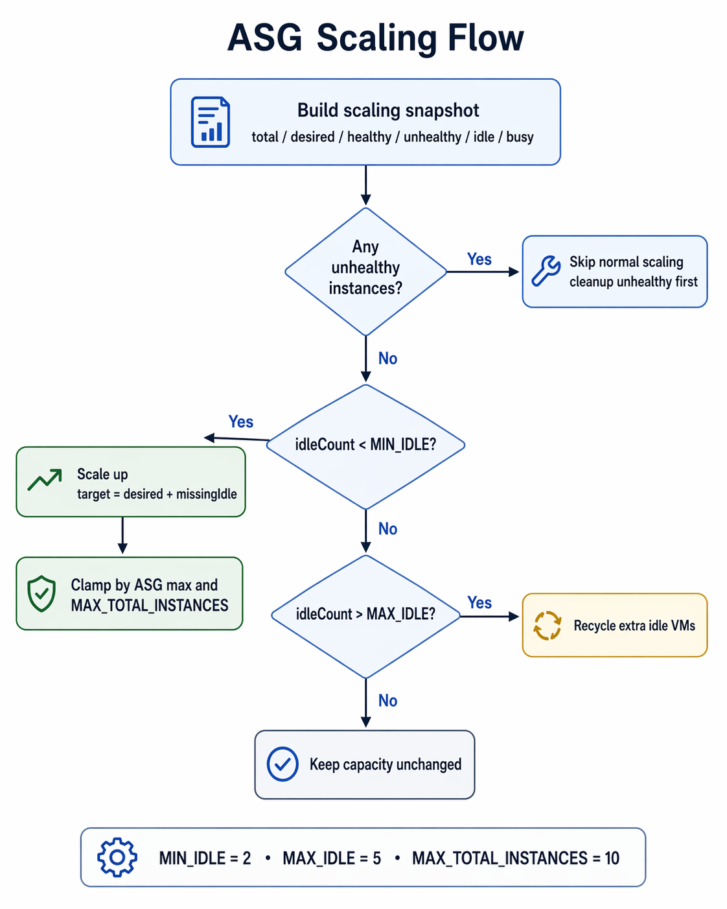

# SpinUp — Core Auto Scaling Logic

This document explains the core autoscaling/runtime allocation logic used in SpinUp.

SpinUp does not create a fresh EC2 instance directly for every project. Instead, it keeps a small pool of reusable EC2 VMs inside an Auto Scaling Group (ASG), assigns one healthy VM to a project, starts a code-server container on that VM, and returns the VM to the idle pool when the project is stopped or deleted.

---

## ASG Scaling Flow



## 1. High-level architecture

```text
User creates project
        ↓
SpinUp control plane
        ↓
Find idle VM from ASG
        ↓
Start code-server container through VM agent
        ↓
Mark project READY
```

There are three main pieces:

| Component | Responsibility |
|---|---|
| **SpinUp control plane** | Handles project lifecycle, VM allocation, ASG scaling, Redis/Postgres state |
| **Auto Scaling Group** | Maintains EC2 VM capacity |
| **VM agent** | Runs on each EC2 VM and starts/stops Docker containers |

The VM agent runs on:

```text
http://<EC2_PUBLIC_IP>:3000
```

The user workspace runs on:

```text
http://<EC2_PUBLIC_IP>:8080
```

So:

```text
3000 = VM agent API
8080 = code-server workspace
```

---

## 2. Project lifecycle

The main runtime lifecycle is:

```text
CREATED
  → ALLOCATING_VM
  → BOOTING_CONTAINER
  → READY
```

### `CREATED`

A project row exists in Postgres, but no VM has been assigned yet.

### `ALLOCATING_VM`

SpinUp is trying to find an available VM from the ASG.

### `BOOTING_CONTAINER`

A VM has been assigned, and SpinUp is starting the project container on that VM.

### `READY`

The container is running and the workspace can be opened in the browser.

---

## 3. Core ASG idea

The ASG is used as a warm VM pool.

SpinUp tries to keep a small number of idle VMs ready so project creation does not always wait for a new EC2 instance to boot.

Current autoscaling config:

```ts
MIN_IDLE = 2
MAX_IDLE = 5
MAX_TOTAL_INSTANCES = 10
IDLE_TIMEOUT_MINUTES = 10
```

Meaning:

- keep at least `2` idle VMs available,
- allow up to `5` idle VMs,
- never go beyond `10` total VMs,
- terminate idle VMs after `10` minutes if unused.

---

## 4. What counts as an idle VM?

A VM is reusable only if all of these are true:

1. it is `Healthy` in the ASG,
2. it is `InService` in the ASG,
3. it is not assigned to any active project in Postgres,
4. Redis marks it as `IDLE` or it is still `UNTRACKED`,
5. it has a public IP,
6. the VM agent responds on port `3000`.

SpinUp verifies the VM agent using:

```text
GET http://<EC2_PUBLIC_IP>:3000/health
```

Only then can the VM be assigned to a project.

---

## 5. Project creation flow

When the user creates a project:

```text
POST /api/project
```

SpinUp does the following:

1. creates or resumes the project,
2. marks it `ALLOCATING_VM`,
3. checks for an idle VM,
4. if no idle VM exists, asks the ASG to increase desired capacity,
5. waits until a healthy VM becomes available,
6. fetches the VM public IP,
7. waits for the VM agent to become healthy,
8. marks the project `BOOTING_CONTAINER`,
9. calls the VM agent to start the code-server container,
10. waits until the container/workspace is ready,
11. marks the project `READY`.

---

## 6. Scale-up logic

Before scaling, SpinUp builds a snapshot:

```text
totalInstances
desiredCapacity
healthyInServiceCount
unhealthyCount
idleCount
busyCount
idleInstanceIds
```

Then it applies these rules.

### Rule 1: unhealthy instances are handled separately

If any ASG instance is unhealthy, SpinUp avoids normal scale decisions and lets cleanup handle those instances first.

### Rule 2: if idle VMs are below minimum, scale up

If:

```text
idleCount < MIN_IDLE
```

SpinUp calculates how many idle VMs are missing and increases ASG desired capacity.

Example:

```text
MIN_IDLE = 2
idleCount = 0
desiredCapacity = 3

missingIdle = 2
new desiredCapacity = 5
```

The desired capacity is always capped by:

```text
MAX_TOTAL_INSTANCES = 10
```

### Rule 3: if idle count is within the target band, do nothing

If:

```text
MIN_IDLE <= idleCount <= MAX_IDLE
```

SpinUp keeps the ASG unchanged.

### Rule 4: if there are too many idle VMs, recycle extras

If:

```text
idleCount > MAX_IDLE
```

SpinUp terminates extra idle VMs to reduce wasted capacity.

---

## 7. Why a distributed scale-up lock is used

Multiple users may create projects at the same time.

Without a lock, multiple requests could all decide:

```text
"No idle VM exists, scale up."
```

That could over-scale the ASG.

SpinUp uses a Redis lock:

```text
lock:asg:scale-up
```

Only one request can perform the scale-up decision at a time.

---

## 8. VM assignment and Redis state

Once a VM is assigned, SpinUp mirrors the runtime state into Redis.

During boot:

```text
status = BOOTING
inUse = true
projectId = <projectId>
instanceId = <instanceId>
publicIP = <publicIP>
containerName = ""
```

After the container becomes ready:

```text
status = RUNNING
inUse = true
containerName = spinup-<projectId>
```

Redis gives the control plane fast access to runtime state, while Postgres remains the source of truth for the project lifecycle.

---

## 9. Container boot logic

Each VM runs a small agent on port `3000`.

SpinUp calls:

```text
POST http://<EC2_PUBLIC_IP>:3000/start
```

with:

```json
{
  "projectId": "...",
  "projectName": "...",
  "projectType": "NEXTJS",
  "containerName": "spinup-<projectId>"
}
```

The VM agent runs:

```bash
docker run -d \
  --name spinup-<projectId> \
  -e PROJECT_ID=<projectId> \
  -e PROJECT_NAME=<projectName> \
  -e PROJECT_TYPE=<projectType> \
  -p 8080:8080 \
  my-code-server
```

The container then prepares the project workspace and starts code-server on port `8080`.

---

## 10. Readiness check

After starting the container, SpinUp waits for runtime readiness.

It checks:

```text
POST http://<EC2_PUBLIC_IP>:3000/containerStatus
GET  http://<EC2_PUBLIC_IP>:8080
```

The project becomes `READY` only after the container is running or the workspace endpoint responds.

---

## 11. Cleanup and reuse

When a project is deleted or stopped:

1. SpinUp calls the VM agent `/stop`,
2. the project container is removed,
3. if the VM is still healthy, it is returned to the idle pool,
4. if the VM is unhealthy, it is terminated,
5. Redis and Postgres runtime assignment fields are cleared.

This allows SpinUp to reuse healthy VMs instead of launching a new EC2 instance for every project.

---

## 12. Summary

SpinUp uses an ASG as a warm pool of EC2 machines.

The control plane does not blindly launch a new VM for every project. It first looks for a healthy idle VM. If none exists, it increases ASG desired capacity while respecting max capacity limits. Once a VM is available, SpinUp calls a VM agent running on that machine to start a deterministic Docker container for the project. The project moves from `ALLOCATING_VM` to `BOOTING_CONTAINER` to `READY` only after the VM agent and code-server runtime are healthy.

In short:

```text
ASG gives machine capacity.
Redis tracks fast runtime state.
Postgres stores project lifecycle.
VM agent starts/stops containers.
code-server container provides the workspace.
```
