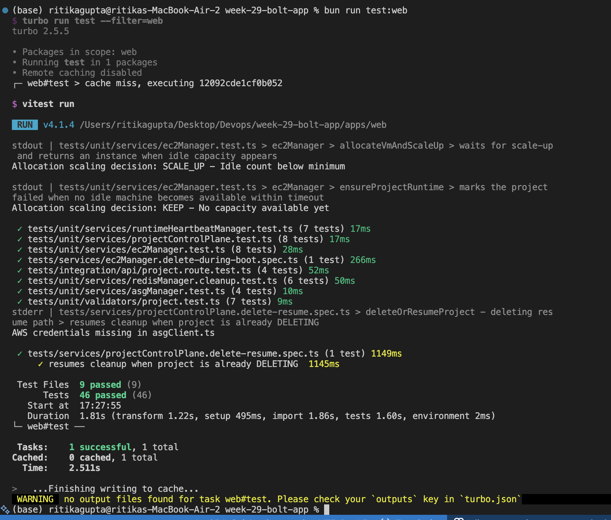
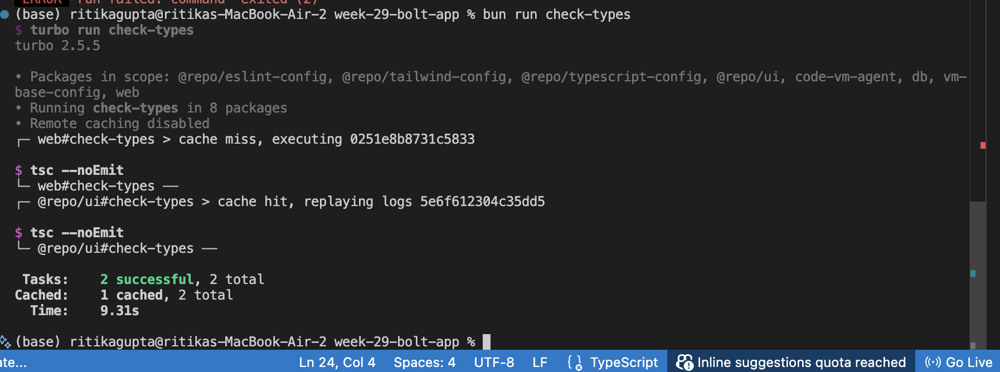
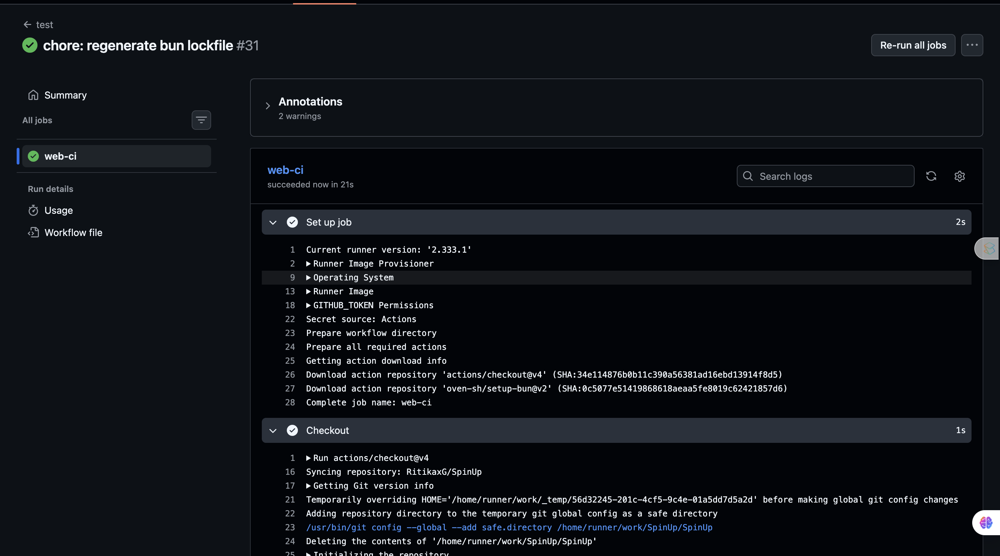
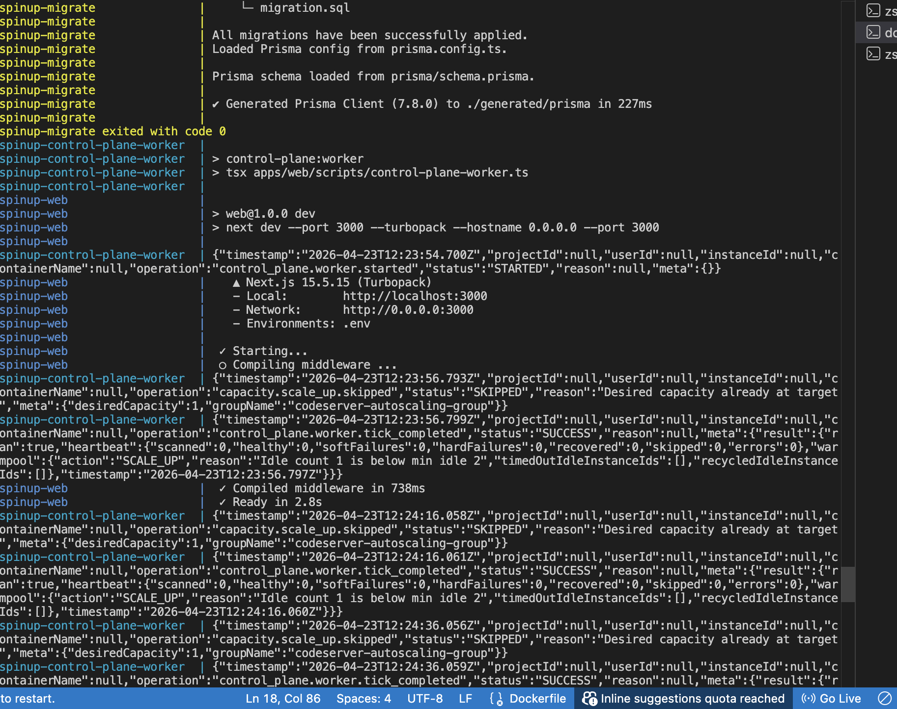
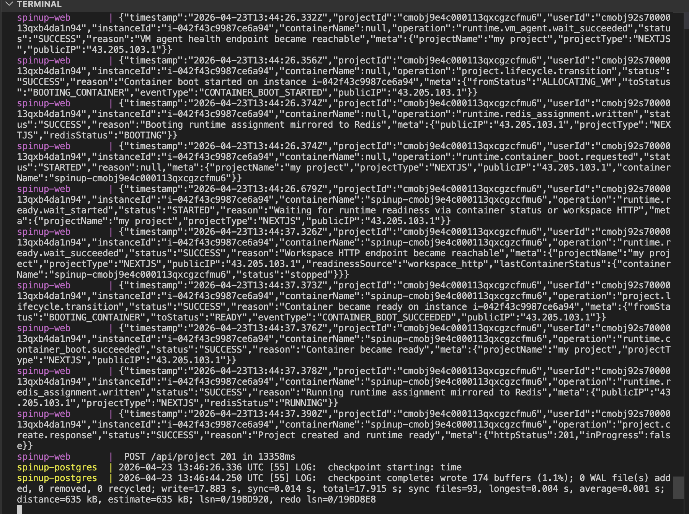
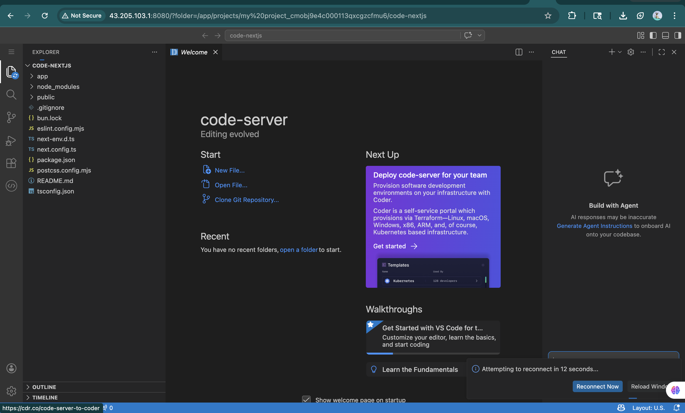

# SpinUp — Working State So Far

This document captures the current working state of SpinUp and provides visual proof that the core local and runtime flows are working.

## Current status

The following checkpoints are currently working:

- test_passed
- check_types_passed
- ci_passed
- docker_compose_up
- container_started_with_compose
- container_running

---

## 1. Tests passed

The test suite is currently passing.

---

## 2. Type checks passed

Static type checks are passing.

---

## 3. CI passed

The CI pipeline is passing for the current state of the project.

---

## 4. Docker Compose stack comes up successfully

The local development stack starts successfully with Docker Compose.

This includes the current local debug/demo mode for:
- postgres
- redis
- migrate
- web

---

## 5. Workspace container starts successfully through the provisioning flow

After project creation, the runtime container is started successfully through the SpinUp provisioning flow.

---

## 6. Workspace container is running

The EC2-hosted runtime container is running and reachable.

---

## What this proves

At this stage, the project has working proof for:

- local control-plane startup
- database and Redis startup through Docker Compose
- successful migration flow
- successful type checking and test execution
- successful project create flow
- successful VM allocation and runtime bring-up
- successful workspace access through the runtime IP

---

## Current local demo note

For the current local demo workflow:

- use Docker Compose for the control plane
- use the fixed ngrok tunnel for Clerk auth
- keep `control-plane-worker` disabled locally for now while using the stable provisioning path

---

