# SpinUp Control Plane Validation

This document records the manual end-to-end validation of SpinUp’s control plane, runtime allocation flow, lifecycle transitions, cleanup behavior, heartbeat recovery, and authorization boundaries.

The goal of this validation pass was to prove:

- one clean happy path
- the 6 non-negotiable edge cases before demo

---

## Scope of validation

### Happy path
Validated the smallest successful end-to-end project lifecycle:

1. create project
2. project enters `ALLOCATING_VM`
3. VM gets assigned
4. public IP resolves
5. VM agent becomes reachable
6. container boots
7. project becomes `READY`
8. Redis assignment is written
9. logs show the lifecycle end to end

### Non-negotiable edge cases
The following critical edge cases were tested:

- repeated create request for the same project
- delete while boot is in progress
- delete after ready
- no idle instance available
- heartbeat failure path
- ownership/auth checks

---

# 1. Happy path validation

A project was successfully created and moved through the expected lifecycle:

`CREATED -> ALLOCATING_VM -> BOOTING_CONTAINER -> READY`

## What this proved

- control plane create flow works
- VM allocation works
- public IP fetch works
- VM agent readiness check works
- container boot and workspace readiness work
- lifecycle transitions are valid
- Redis assignment is mirrored correctly
- API returns success when runtime is ready

## Evidence

### Application logs
These screenshots show the successful create request and the runtime moving through allocation, boot, and ready states:

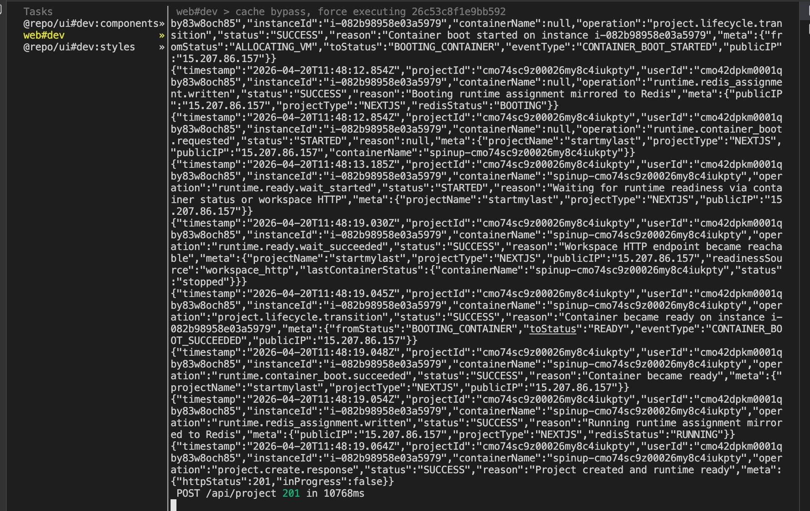
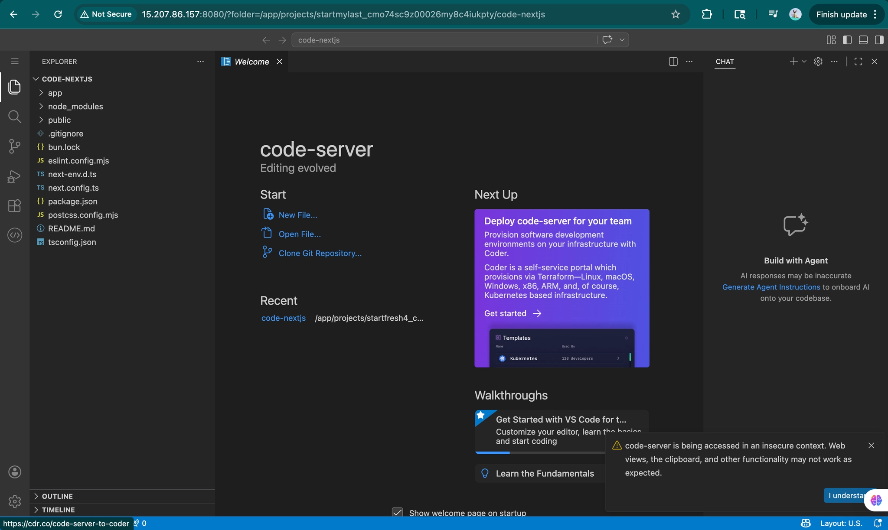

### Database checks
These queries were used to verify the DB state after a successful create:

- `Project` row created correctly
- lifecycle recorded in `ProjectEvent`
- current runtime reflected in `ProjectRoom`

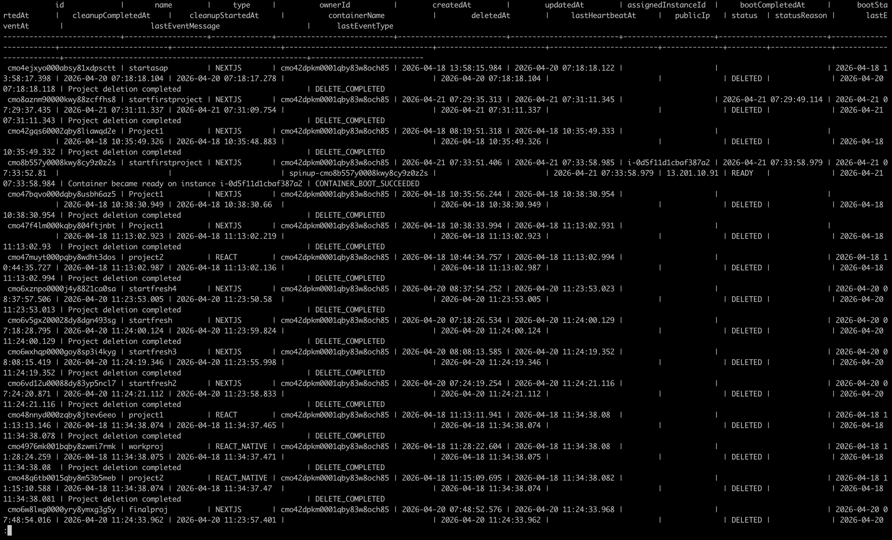

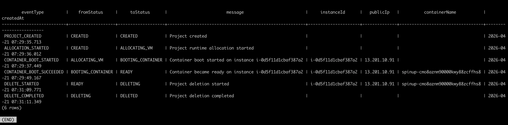

### Redis checks
These checks verified that the runtime assignment was mirrored correctly in Redis:

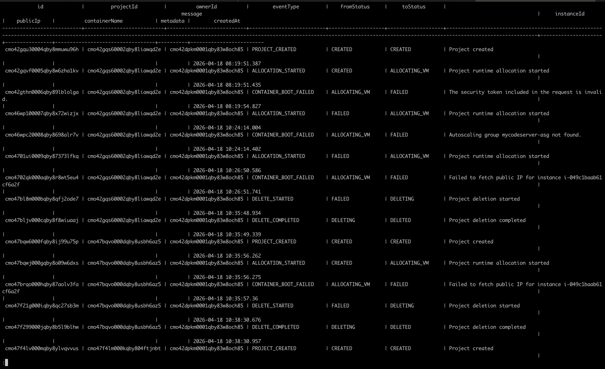

---

# 2. Repeated create request does not create duplicate runtime

Concurrent / repeated create was tested for the same project name.

## What was verified

- only one non-deleted `Project` row existed for that project
- only one runtime allocation happened
- only one lifecycle chain existed
- no duplicate VM assignment occurred
- no duplicate container boot occurred

## What this proved

- create locking works
- create-or-resume behavior works
- duplicate clicks do not corrupt state

## Result

**Pass**

## Evidence

These screenshots show that the repeated request did not create duplicate runtime state:

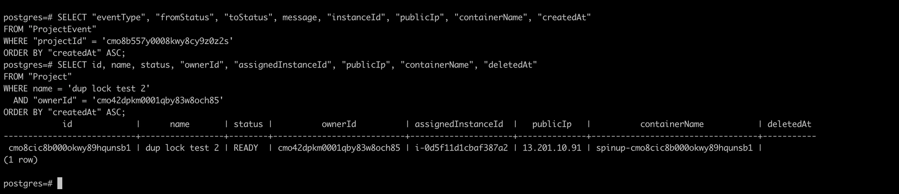
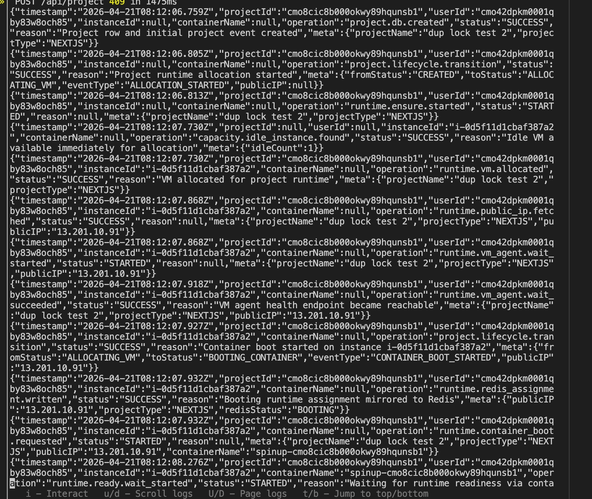

---

# 3. Delete during boot race was reproduced, fixed, and revalidated

This was one of the most important control plane races.

## Initial bug found

When delete hit during provisioning, the project could transition to `DELETING` while provisioning still continued and attempted:

`DELETING -> BOOTING_CONTAINER`

This caused an invalid lifecycle transition and project failure.

## Fix applied

The runtime provisioning flow was made deletion-aware:

- re-check project lifecycle during provisioning
- stop provisioning if project is already `DELETING` or `DELETED`
- allow repeated delete requests to resume / reconcile cleanup
- keep the lifecycle manager strict

## Retest result

After the fix:

- delete during `ALLOCATING_VM` or boot no longer caused stale `READY`
- no illegal lifecycle transition escaped as a `500`
- repeated delete requests resumed cleanup correctly
- final state settled to `DELETED`

## What this proved

- delete locking works
- delete resume / reconcile works
- cleanup and finalization are reliable under race conditions
- lifecycle guardrails prevented corrupted state

## Result

**Pass after fix**

## Evidence

### Before the fix
This screenshot shows the original broken race:

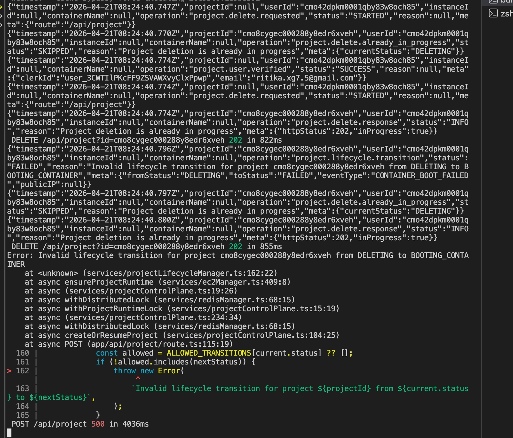

### After the fix
These screenshots show the corrected behavior and successful deletion finalization:

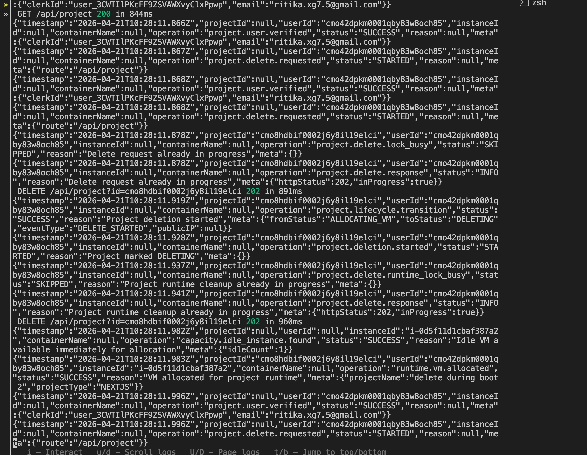
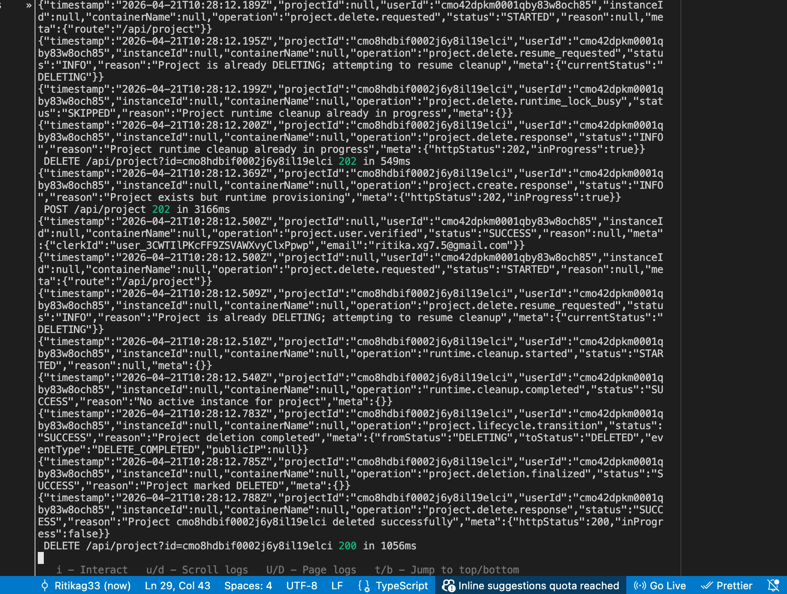

### Database verification
These checks confirmed that the project no longer remained stale and settled correctly after deletion:

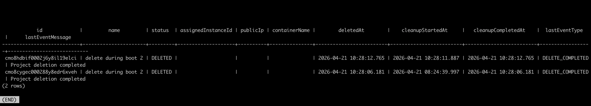
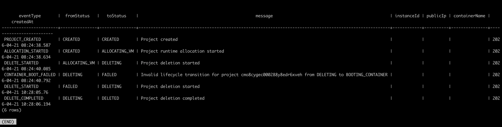

---

# 4. Delete after ready returns healthy instance to idle pool

Delete was tested on a project that had already reached `READY`.

## What was verified

- project transitioned to `DELETING`
- runtime cleanup started
- container was stopped
- healthy instance was returned to idle pool
- project finalized as `DELETED`

## What this proved

- ready-state deletion works
- runtime cleanup works
- warm-pool reuse behavior works
- healthy instances can be recycled instead of always terminated

## Result

**Pass**

## Evidence

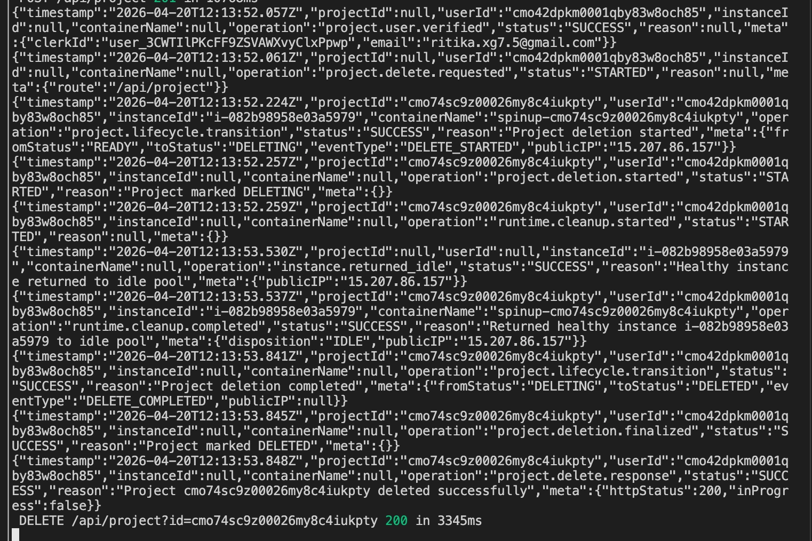

---

# 5. No idle instance available path works

Project creation was tested when no healthy idle VM was available.

## What was verified

- control plane entered allocation wait path
- scale-up logic triggered
- unhealthy idle candidates were skipped
- a healthy VM eventually became available
- project still reached `READY`

## What this proved

- no-idle handling works
- autoscaling wait path works
- allocator does not immediately fail when the pool is empty
- health filtering for idle candidates works

## Result

**Pass**

## Operational insight

Keeping `min idle = 1` made the create flow significantly more reliable for demo use because one warm VM is always available.

## Evidence

These screenshots show the scale-up path and final successful readiness:

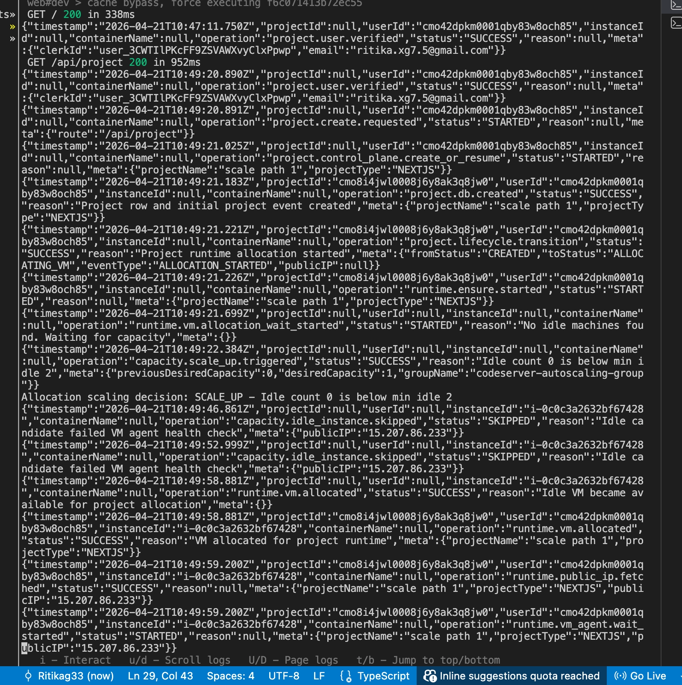
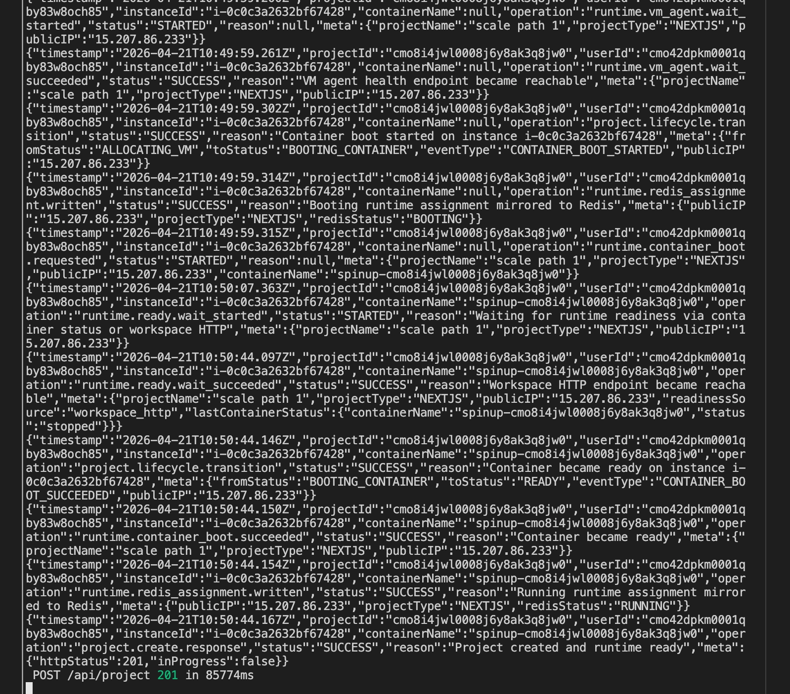
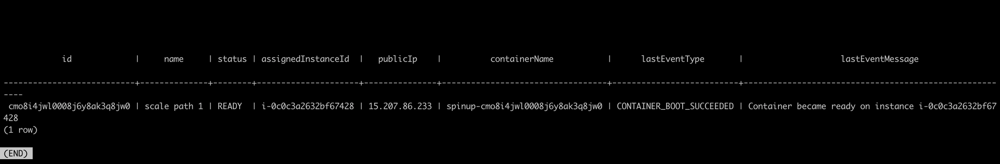

---

# 6. Heartbeat failure path works

A failure recovery path was tested by intentionally stopping the runtime container for a project that was already `READY`.

## What was verified

- project started in `READY`
- container was stopped manually
- VM agent reported container status as `stopped`
- heartbeat reconcile detected the failure
- recovery / cleanup flow ran
- project transitioned `READY -> FAILED`
- runtime assignment was cleared
- healthy VM was returned to idle pool

## What this proved

- heartbeat detection works
- hard failure path works
- runtime cleanup works
- project failure marking works
- Redis and DB state are reconciled correctly after failure

## Result

**Pass**

## Evidence

### Manual failure injection
The runtime container was intentionally stopped using the VM agent:

```bash
curl -i -X POST "http://15.207.86.233:3000/stop" \
  -H "Content-Type: application/json" \
  -d '{"containerName":"spinup-cmo8iau3k000gj6y8vpdj99gm"}'
```

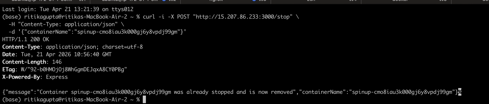

### Verify the container is stopped

```bash
curl -i -X POST "http://15.207.86.233:3000/containerStatus" \
  -H "Content-Type: application/json" \
  -d '{"containerName":"spinup-cmo8iau3k000gj6y8vpdj99gm"}'
```

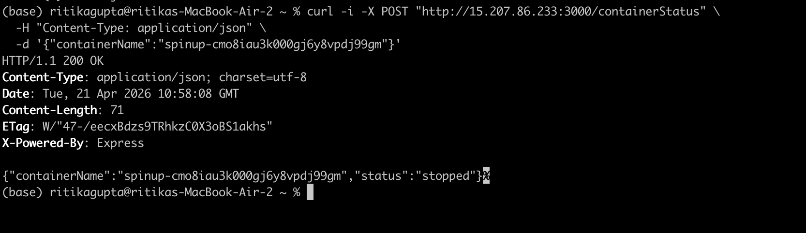

### Heartbeat recovery evidence
These screenshots show the reconcile path and final state after failure recovery:

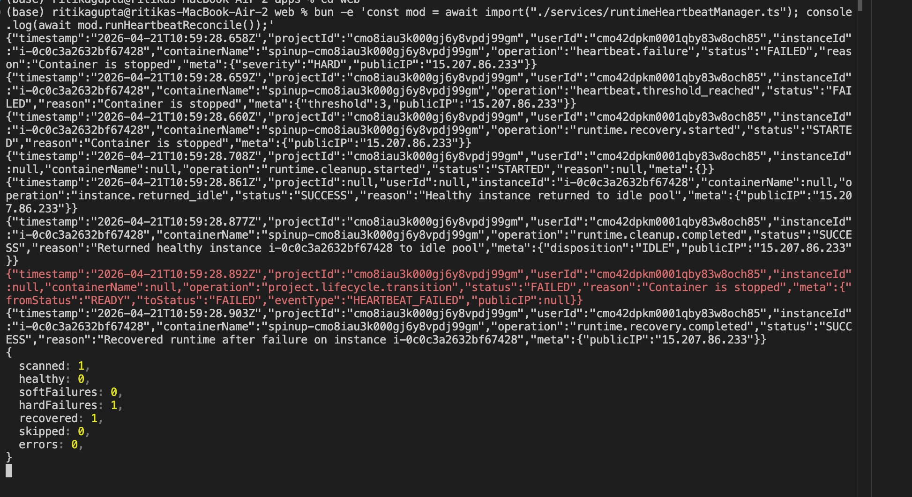
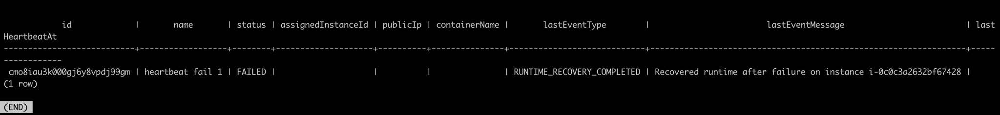
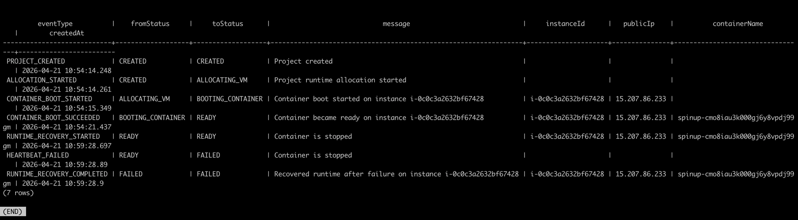

---

# 7. Unauthenticated requests are blocked

Tested `POST /api/project` without an authenticated Clerk user.

## What was verified

- request returned `401`
- logs recorded auth failure
- no project was created

## What this proved

- route-level authentication enforcement works

## Result

**Pass**

## Evidence

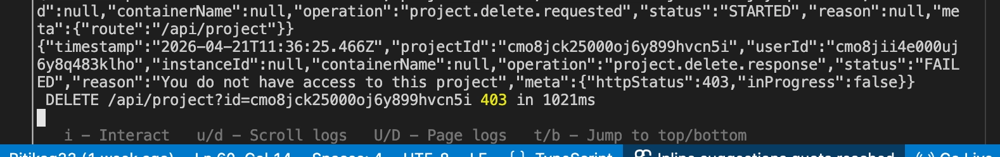

---

# 8. Cross-user delete is forbidden

Tested deleting User A’s project while signed in as User B.

## What was verified

- request returned `403`
- response reason indicated lack of access
- target project remained unchanged in DB
- owner remained correct
- project was not deleted

## What this proved

- owner-scoped authorization works
- cross-user delete is blocked correctly

## Result

**Pass**

## Evidence

These screenshots show the forbidden delete attempt and DB proof that the target project remained unchanged:

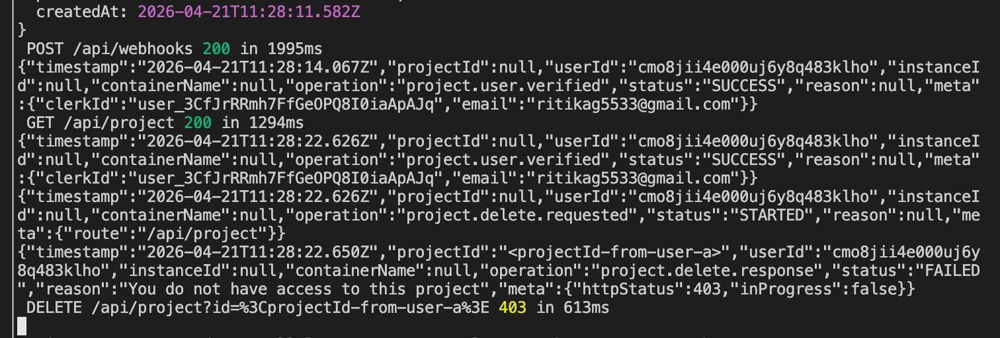
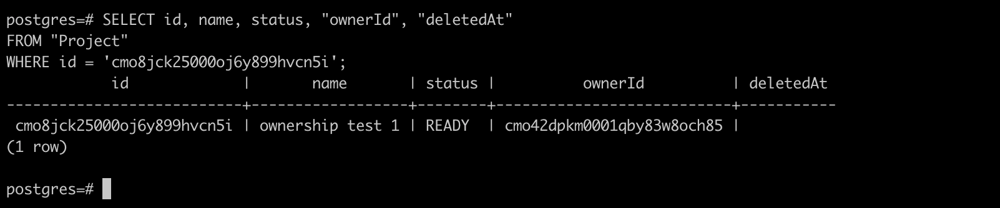

---

# Additional behavior verified

## Single active runtime per user

Tested creating a second project for the same user while another project already had an active runtime.

## What was verified

- old project runtime was cleaned up
- instance was returned to idle
- the same instance was reassigned to the new project
- only one active runtime remained for the user
- Redis mapped the active instance only to the new project
- `ProjectRoom.vmState` showed:
  - old project: `STOPPED`
  - new project: `RUNNING`

A follow-up improvement was made so the old project transitions cleanly to an inactive lifecycle state instead of remaining semantically stale.

## What this proved

- single-runtime-per-user policy works
- runtime handoff is consistent across DB, `ProjectRoom`, and Redis

## Result

**Pass**

## Evidence

### Application logs
These screenshots show the previous project being stopped and the runtime being reassigned to the new project:

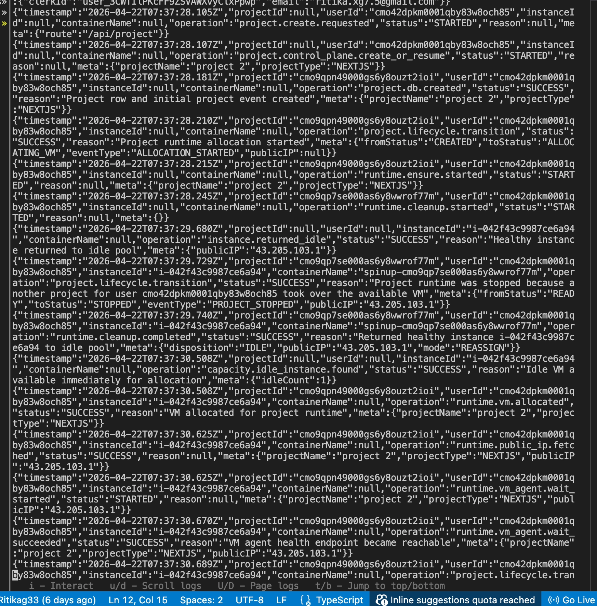
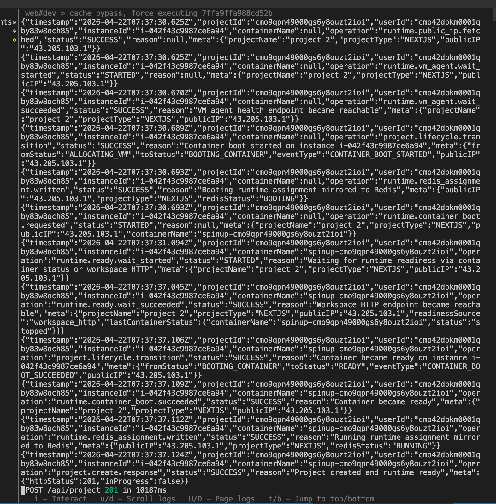

### Project table verification
The following query was used to verify that only the new project retained the active runtime:

```sql
SELECT id, name, status, "assignedInstanceId", "publicIp", "containerName", "lastEventType", "lastEventMessage"
FROM "Project"
WHERE id IN (
  'cmo9qp7se000as6y8wwrof77m',   -- first project
  'cmo9qpn49000gs6y8ouzt2ioi'    -- second project
);
```

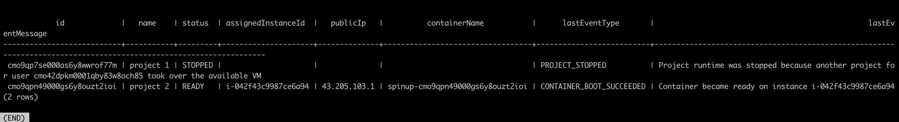

### ProjectRoom verification
The following query was used to verify current runtime state per project:

```sql
SELECT "projectId", "userId", "vmState"
FROM "ProjectRoom"
WHERE "projectId" IN (
  'cmo9qp7se000as6y8wwrof77m',
  'cmo9qpn49000gs6y8ouzt2ioi'
);
```

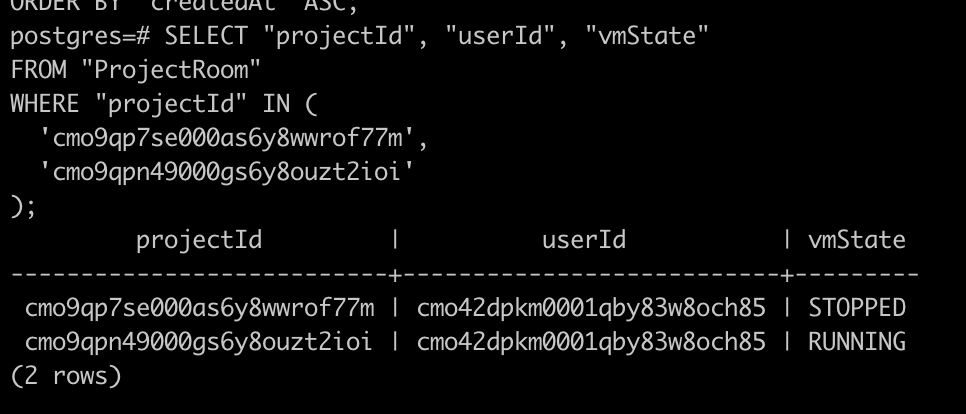

---

# Final result

## Happy path
- pass

## Edge cases
- repeated create request: pass
- delete during boot: pass
- delete after ready: pass
- no idle instance available: pass
- heartbeat failure path: pass
- unauthenticated blocked: pass
- cross-user delete blocked: pass

---

# Features validated by this test pass

This validation cycle proved the following parts of SpinUp are working:

- project creation and control plane orchestration
- lifecycle transition correctness
- distributed create / delete / runtime locking
- VM allocation and warm-pool behavior
- runtime reassignment for the same user
- VM agent health checks
- container boot and readiness checks
- Redis runtime assignment mirroring
- runtime cleanup and deletion finalization
- heartbeat monitoring and recovery
- unauthenticated access blocking
- owner-scoped authorization

---

# Important fixes discovered during testing

## Delete-during-boot race
A real race was found where delete could move a project to `DELETING` while provisioning still tried to continue boot. This was fixed by making provisioning deletion-aware and by allowing delete requests to resume cleanup reconciliation.

## Old project stale-ready semantics
When a new project for the same user took over the runtime, the old project originally retained a stale `READY` lifecycle status even after its runtime was detached. This was improved so the old project transitions cleanly to an inactive / stopped state.

## Warm-pool stability
Cold-start behavior is more fragile than warm-pool behavior. For reliable demo performance, maintaining at least one warm idle VM (`min idle = 1`) significantly improves success rate.

---

# Recommended demo operating mode

For reliable demos:

- maintain at least one warm idle VM
- keep autoscaling enabled for overflow
- preserve strict lifecycle transitions
- keep heartbeat reconcile enabled
- avoid preserving failed runtimes unless actively debugging

---

# Attached evidence

This validation report is backed by:

- application logs
- SQL queries against:
  - `Project`
  - `ProjectEvent`
  - `ProjectRoom`
- Redis state checks
- HTTP request / response screenshots
- manual VM agent command results

All screenshots and query outputs are attached alongside this document.
